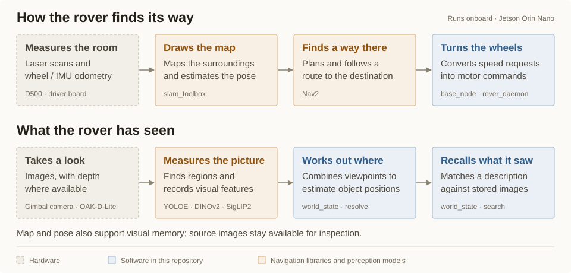

# Waveshare UGV Rover

A rover that maps its surroundings, keeps a visual memory of what it has seen,
and connects conversation to physical actions. This repository brings together
browser control, ROS 2 navigation, onboard perception and realtime voice on a
Waveshare UGV Rover powered by an NVIDIA Jetson Orin Nano.

The browser is the cockpit: drive the rover, watch its camera, choose a destination
on the map, inspect recorded observations or start a voice conversation. Hardware
control, mapping and visual memory run onboard. Conversation uses Alibaba
DashScope's hosted Qwen Omni model.

## What it does

- **Drive from a browser.** Manual driving, a live camera view, gimbal and
  headlight controls, battery status and a map share one web console.
- **Map and navigate.** ROS 2 Jazzy, `slam_toolbox` and Nav2 turn lidar scans and
  wheel/IMU odometry into a map and routes to selected destinations. Frontier
  exploration chooses reachable edges of the map to extend it, with a time limit
  and a stop control.
- **Talk and look.** Use the browser's microphone and speaker for realtime
  conversation. The model can call rover tools and request camera images to
  answer visual questions.
- **Track faces locally.** YuNet detects faces on the rover; a shared aiming
  controller moves the gimbal to follow a selected face.
- **Search visual memory.** Recorded image regions can be searched with a text
  description. Observations retain their source images and measurements; the
  resolver combines evidence from different viewpoints to estimate object
  positions. Tools expose search and navigation to a viewpoint near a match.
- **Inspect and reproduce.** The console exposes the observations behind a
  placement. Sensor probes, recorded-run replay and controller simulations support
  diagnosis and testing against real rover recordings.

## How it fits together

The Jetson runs the rover services. A single daemon owns the driver-board serial
connection and gimbal camera, and exposes tools used by the console and voice
session. ROS owns mapping and route execution; the visual-memory service stores
observations and estimates where things are.

[](docs/rover-architecture/rover-architecture.pdf)

The [full architecture drawing](docs/rover-architecture/rover-architecture.pdf)
expands these two views: **how the rover finds its way** and **what it has seen**.

World-state perception uses YOLOE regions with DINOv2 and SigLIP2 appearance
vectors, accelerated through TensorRT on the Orin. Geometry supplies placement
evidence; text search compares a description with stored visual features. Face
tracking uses a separate local YuNet detector.

Voice requires internet access and a DashScope API key held on the rover. The
browser supplies audio; manual driving and status are available independently
of the voice service.

## Hardware

| Part | Role |
|---|---|
| Waveshare UGV Rover chassis and General Driver for Robots board | Motors, encoders, IMU, lights, gimbal and battery telemetry |
| NVIDIA Jetson Orin Nano | Rover services and GPU perception |
| D500 2D lidar | Scans for mapping and navigation |
| Gimbal-mounted UVC camera | Camera view, face tracking and visual observations |
| OAK-D-Lite | Stereo depth measurements |

The repository also includes [parametric CAD for the OAK rail mount](cad/README.md).

## Current limits

Navigation uses a horizontal lidar scan: it cannot detect drops or obstacles
entirely above or below that scan plane. Maps and the last trusted pose persist
between sessions; restoring a map does not guarantee correct localization if the
rover has been moved while off. The console provides a manual refit control.

Visual memory is experimental. Gimbal pointing error and camera alignment limit
placement accuracy, and repeated appearances or ambiguous geometry can produce
incorrect associations. The stored images and uncertainty are available for
inspection. See [world-state measurements and limitations](world_state/README.md).

The web console uses HTTPS and assumes a trusted local network; it has no login.

## Explore the code

| Component | Contains |
|---|---|
| [Rover daemon](rover_daemon/README.md) | Hardware ownership, tool API and navigation integration |
| [Navigation](ros_nav/README.md) | ROS 2 stack, map persistence, exploration, calibration and replay |
| [World state](world_state/README.md) | Observation storage, perception, association and text search |
| [Episodic memory](autonomy/README.md) | What the rover did and why, with names that outlive the world state |
| [Web console](drive_web/README.md) | Browser controls, maps, observation inspection and audio bridge |
| [Voice](voice_chat/README.md) | Qwen realtime protocol, prompts and rover client |
| [Face tracking](face_tracking/README.md) | YuNet detection, aiming geometry and calibration |
| [Stereo depth](oak_depth/README.md) | OAK-D-Lite depth service |
| [Deployment](deploy/README.md) | Component manifest, source deployment and service verification |

## Getting started

For the system overview, start with the [architecture guide](docs/rover-architecture/README.md).
To set up rover services, follow the [deployment guide](docs/runbooks/deploy.md) and the
component READMEs. Installation depends on the attached devices, chassis
calibration, model assets and host configuration.

For workstation sensor tools, create a Python environment and install
[`requirements.txt`](requirements.txt). On Windows PowerShell:

```powershell
python -m venv .venv
.\.venv\Scripts\python.exe -m pip install -r requirements.txt
.\.venv\Scripts\python.exe oak_camera/probe_device.py
```

Additional bench tools cover [lidar](lidar/), [USB cameras](usb_cameras/) and
[driver-board control](driver_board/). Their hardware connections and calibration
procedures are in [`docs/reference/`](docs/reference/README.md).

[`docs/`](docs/README.md) is organized by the question a document answers: what
has to be true of the rover ([requirements](docs/requirements/README.md)), what
is planned ([plans](docs/plans/README.md)), what was measured
([progress](docs/progress/README.md)), why it is this way
([decisions](docs/decisions/README.md)), what the hardware is
([reference](docs/reference/README.md)) and what to type
([runbooks](docs/runbooks/README.md)). The requirement summary in
[`docs/README.md`](docs/README.md) is the quickest read of how much of the rover
is actually settled.

For console development without hardware, the [voice component guide](voice_chat/README.md)
includes a mock rover. Navigation recordings and replay tools are described in
the [navigation guide](ros_nav/README.md).
