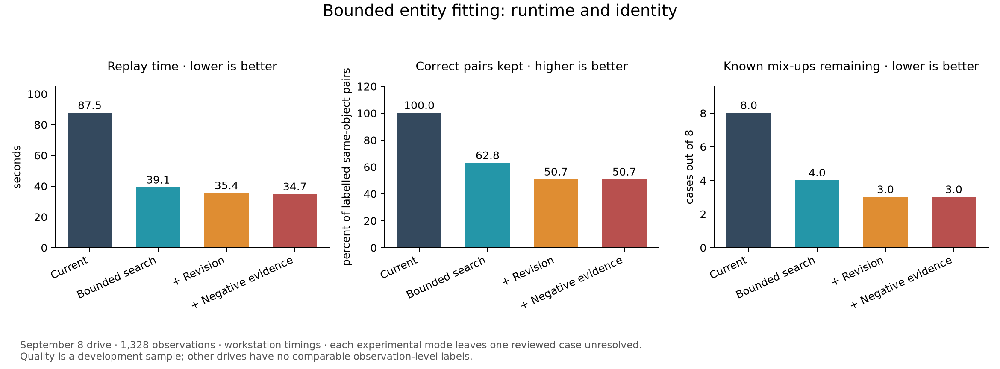
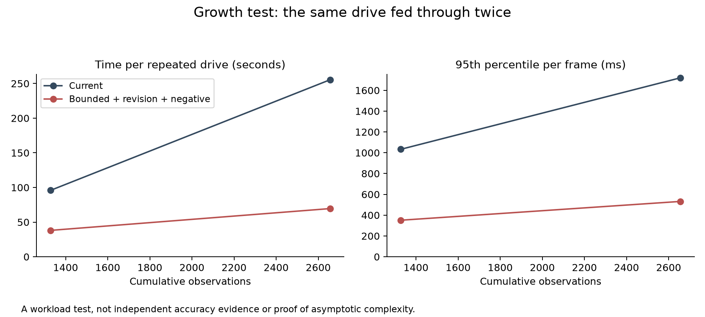

# Bounded entity fitting is faster, but loses correct identities

**Keep the production resolver.** A working offline prototype reduces the cost
of association and can revise accepted memberships, but its identity losses
outweigh its corrections. Negative evidence adds no demonstrated correction on
the locally stored recordings. R-WS-13 remains open.

## What was tested

Three distinct local recordings: `captures/m0-2026-09-07/world.db` (1,262
observations, 231 recorded detection groups), `captures/m0-2026-09-08/world.db`
(1,328, 211), and `captures/m0-2026-09-08-acceptance/world.db` (1,208, 214).
The 293-observation targets capture overlaps the acceptance recording and is
not counted as an independent drive.

The unmodified resolver reproduced 152 entities and 1,013 attached observations
on the September 8 drive. All 76 memberships in the existing labelled set match
exactly by original observation ID. This reproduces the investigated faults
before changing the resolver.

The experiment has three stages, measured separately: bounded discovery and
matching; bounded revision of accepted associations; and depth-supported
negative evidence. Each observation viewpoint retrieves its own shortlist.
Archive observations remain intact. The implementation and reproduction
commands are in the [component README](../../world_state/README.md).

## Identity is the deciding result

| September 8 drive | Replay seconds | Existing correct pairs retained | Reviewed cases still mixed | Separated | Unresolved |
|---|---:|---:|---:|---:|---:|
| Production resolver | 87.5 | 100.0% | 8 | 0 | 0 |
| Bounded search | 39.1 | 62.8% | 4 | 3 | 1 |
| Bounded search and revision | 35.4 | 50.7% | 3 | 4 | 1 |
| Bounded search, revision and negative evidence | 34.7 | 50.7% | 3 | 4 | 1 |

The positive check comprises 5,020 observation pairs within the 52 entities
previously labelled as one real object. Retaining a pair means both observations
remain assigned to the same entity. Splitting them and leaving either pending
are counted separately. The baseline's 100% is retention of the reviewed
memberships, not a claim of perfect overall identity accuracy.

The negative check comprises eight cases whose individual crops were reviewed:
shelf/painting, armchair/person, sofa/person, chairs/painting, different landscape
pictures, painting/doorframe/arch, arch/doorway, and two different framed pictures.
The observation IDs and review limits are checked into
[the constraint file](../../world_state/labels/incremental-2026-09-10.json).
These are development judgments by the coding agent, not a held-out or
owner-confirmed sample. Ambiguous small crops were excluded; the other nine
original mixed verdicts were preserved without pretending to know which
individual observations caused them. This is not an overall merge rate.

The original entity-verdict transfer is insufficient for this question: when a
mixed entity is successfully split, it transfers the old mixed verdict to the
largest surviving part. A regression test now demonstrates that a corrected
split is scored as separated, while an unassigned observation is unresolved.

The full prototype creates 203 entities against 152 in the production replay.
Additional attachments therefore cannot be read as an improvement: the pair
check shows that much of the extra structure is fragmentation. Revision detaches
39 observations and ends with 52 entities still in its review queue. Bounded
work per frame does not establish that the queue can keep up indefinitely.

## Speed across the other recordings

| Recording | Production seconds | Bounded search | With revision | With negative evidence |
|---|---:|---:|---:|---:|
| September 7 folder | 80.3 | 30.6 | 30.0 | 29.9 |
| September 8 drive | 87.5 | 39.1 | 35.4 | 34.7 |
| September 8 acceptance | 80.4 | 37.8 | 75.6 | 40.3 |

These are individual workstation runs. Background load was not controlled;
the acceptance revision timing is substantially slower than the same revision
with an additional negative-evidence check. Small timing differences do not
establish an improvement. The JSON also records geometry-operation counts,
per-frame times, environment, source rows and implementation hashes. The other
two drives have no equivalent observation-level identity labels, so their
timings and entity counts do not establish accuracy gains.

## Growth with observation history

The same drive was replayed twice, retaining accumulated state and using new
observation IDs and timestamps. This is a workload test, not fresh evidence.

| | First 1,328 observations | Next 1,328 | Total 2,656 |
|---|---:|---:|---:|
| Production resolver | 95.8 s | 255.4 s | 351.2 s |
| Full bounded prototype | 38.1 s | 69.5 s | 107.6 s |

The second block costs 2.67 times the first in production and 1.83 times in the
prototype. The result supports a reduction in growth cost, but does not prove
linear complexity or constant latency. Candidate density, archive queries,
entity bookkeeping, cross-map adoption and the revision backlog remain relevant.
No RAM bound or Orin latency claim was established by this test.

## Why negative evidence did not help here

The implemented rule asks whether reliable depth sees clear space through the
entity's proposed position. It requires the whole projected uncertainty patch
to have valid depth beyond the position, and three separated viewpoints must
contradict that same position. Missing pixels, nearer surfaces, edge clipping,
uncertain pose or placement, and stale depth abstain. Evidence resets when the
position changes. It does not turn a failed or skipped detector run into a miss.

The September 7 folder has no usable depth archive for these checks. The
September 8 drive supplies 173 evaluated depth frames, but the candidate checks
are overwhelmingly outside the usable field, contain missing depth, or have
uncertain pose/placement. The acceptance capture gives the same outcome.
**There are zero clear contradictions and zero negative-evidence placement
withdrawals across all three drives.** Identical membership results with and
without the rule confirm that it contributed no correction.

This does not disprove visibility-aware negative evidence. It shows that this
conservative implementation has no demonstrated benefit on these recordings.
The calibrated probability of a detector missing a visible object is still
unknown, and these replays omit frames which stored no detections. Device
intrinsics come from the archived September 7 calibration; the projection uses
the current mount transform rather than per-frame calibration records.

## What was corrected during development

The first prototype gave old pending observations the shortlist for the newest
camera viewpoint. The labelled replay exposed the fragmentation this caused.
Each viewpoint now retrieves its own shortlist, covered by a regression test.
Correct-pair retention for bounded search improved from 52.5% to 62.8%, still
well below an acceptable result. Pilot results remain under
`captures/incremental-review/pilot/`; they are not the final table above.

A bounded memoization control was also tried. Caching complete geometry
arguments reduced actual geometry calls but key construction cost more than
it saved: it reached only 81 of 211 frames in 35.9 seconds before the explicit
35-second budget stopped it. Its partial result is marked incomplete. This
specific cache implementation is not recommended.

## Next experiment and acceptance decision

1. **Make candidate retrieval preserve decisions before permitting revision.**
   Run it beside the full candidate search and measure whether it retrieves the
   accepted entity and plausible competitors for each observation. An exhausted
   shortlist must defer the decision or schedule a larger local search; it must
   not silently justify another entity. Retain useful separated viewpoints when
   selecting the bounded discovery pool. First require no loss of the 5,020
   previously correct pairs on this development recording, then validate on
   independently labelled data.
2. **Give revision competing explanations.** The current mask-based audit can
   detach an observation but is not joint probabilistic fitting of one versus
   two objects. Test a local one-object/two-object fit with reversible membership
   and positive support for each proposed position. Compare it against bounded
   search alone; this revision rule currently loses more correct associations.
3. **Establish usable negative evidence before tuning a penalty.** Review
   specific expected-image regions for the false painting position; obtain
   unobstructed views inside the depth camera's field if the archive cannot
   supply them. Record empty frames, camera pose, calibration and depth. Measure
   detector misses, occlusions and correlated views before assigning a
   non-detection likelihood.
4. **Only activate after an independent acceptance drive and Orin measurement.**
   The existing resolver remains selected. R-WS-13 has not moved toward settled
   on the strength of a faster but less faithful reconstruction.

## Artifacts and verification

- [Compact measured results](2026-09-10-bounded-entity-fitting.json) and
  [CSV comparison](2026-09-10-bounded-entity-fitting.csv).
- Full memberships, timings, operation counts and source hashes:
  `captures/incremental-review/final/` locally; regenerate with
  [bench_incremental.py](../../world_state/bench_incremental.py) and
  [report_incremental.py](../../world_state/report_incremental.py).
- Local verification: 831 world-state checks passed, plus nine targeted tests
  for historical retrieval, per-view shortlists, revising memberships, retaining
  measurements, vetoing rejected attachments, negative-evidence abstention and
  correlation, split scoring, and cache correctness.
- No source recording or active world database was altered. The experimental
  resolver is opt-in for the benchmark and is not selected by the daemon.
- Deployment is unverified: the SSH alias, service address on ports 22 and
  8769, and documented fallback addresses were unavailable from this workstation.
  The committed source still needs deployment and on-host verification when
  connectivity is restored; activating the experimental algorithm is not
  recommended.
